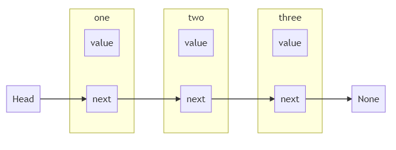

# Linked lists

A **linked list** is a linear _collection_ of the elements, called nodes, where every element contain a reference to the next one. It is possible to have _duplicates_, the number of elements contained is not fixed, and since is a sequence, can be imagined as a chain.



As opposed to an array, it is fairly simple to _add_ or _remove_ an element, since this involve the creation or deletion of a single node and the change of some pointers.

As an array, _searching_ for an element imply the traverse of all the data structure in the worst case.

There can be essentially three different types of linked lists:

- **Singly Linked Lists**: where every element contain a reference to the next one.
- **Double Linked Lists**: where every element contain a reference to the next and previous one.
- **Circular Linked Lists**: where the chain of nodes link to itself at some point creating a circle.

## Complexity

The _time complexity_ for accessing of searching elements in this data structure, if `K` is the number of element already present, would be $O(K)$. Inserting or removing elements on the head or on the tail instead would be $O(1)$.

For _space complexity_, if $N$ is the total number of nodes and $M$ is the size of the data contained into a node will be $O(N * M)$.

## Practice question

- **Reversing a linked list**: given a singly linked list, return another linked list that is the reverse of the first.
- **Detecting Loops**: implement a function that can detect the presence of loops in a linked list.
- **Flatten a linked list**: given a linked list where the value of each node is a sorted linked list, combine all nested lists into a single (sorted) linked list.
- **Add one**: given a non-negative number in the form of list elements (i.e. [4, 2, 1] instead of 421), add one to the number and return the output in the form of a new list.
- **Duplicate number**: given an array of length = n that contains integers from 0 to n - 2, and considering that each number in the array is present exactly once except for one number which is present twice, find and return this duplicate number present in the array.
- **Max Sum**: given an array containing numbers, find and return the largest sum in a contiguous subarray within the input array.
- **Pascal's triangle**: Find and return the nth row of Pascal’s triangle in the form a list. n is 0-based.
- **Even after odds nodes**: given a linked list with integer data, arrange the elements in such a manner that all nodes with even numbers are placed after odd numbers. Do not create any new nodes and avoid using any other data structure. The relative order of even and odd elements must not change.
- **Skip i delete j**: given a linked list and two integers, i and j, retain the first i nodes and then delete the next j nodes. Continue doing so until the end of the linked list.
- **Swap nodes**: given a linked list, swap the two nodes present at position i and j, assuming 0 <= i <= j. The positions are based on 0-based indexing. You have to swap the nodes and not just the values.

## Implementations

### Singly Linked Lists

There is room for optimization here, for example we can keep track of the tail of the list, so the _append_ operation will take $O(1)$ instead of $O(n)$, since we do not need anymore to traverse the list.

The same can be done with the _size_ of the list.

```python
class Node:

  def __init__(self, value):
    self.value = value
    self.next = None

class LinkedList:

  def __init__(self):
    self.head = None

  def append(self, value):
    if self.head is None:
      self.head = Node(value)
      return
    node = self.head
    while node.next:
      node = node.next
    node.next = Node(value)
    return
```

### Double Linked Lists

```python
class DoubleNode:

  def __init__(self, value):
    self.value = value
    self.next = None
    self.previous = None

class DoublyLinkedList:

  def __init__(self):
    self.head = None
    self.tail = None

  def append(self, value):
    if self.head is None:
      self.head = DoubleNode(value)
      self.tail = self.head
      return
    self.tail.next = DoubleNode(value)
    self.tail.next.previous = self.tail
    self.tail = self.tail.next
    return
```
