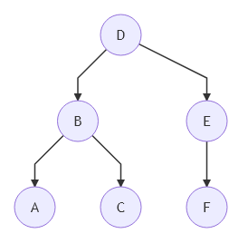

# Trees

A **Tree** is a non linear _collection_ of elements called nodes connected by edges. There cannot be cycles or unconnected nodes, that support four types of operation: add and remove an elements on one end, and add and remove an element on the other end.

## Terminology

There is some specific terminology associated with the tree:

- `Level` of a node: number of edges to the root plus one.
- `Parent`: node connected to a higher level.
- `Child`: node connected to a lower level.
- `Leaf`: node that has no children.
- `Edge`: connection between two nodes.
- `Path`: group of connections.
- `Height` of a node: number of level between it and the further leaf of the tree.
- `Depth` of a node: number of edges to the root.

## Operations

### Insert

Inserting an element into a _Tree_ when he has no order is a simple operation, all we need to do is find the first node that doesn't have all the children and add to it the new node. In the worst case is that we travel the longest path until we found the leaf.

### Delete

###

### Traversal

Since a _Tree_ is a not linear data structure, can be traversed in multiple ways.



There are two common approach used to explore it:

- **Depth First Search (DFS)**: were the priority is to explore child nodes first. There are three main way to do this.
  - **pre-order**: visit a node, traverse it's left subtree and then it's right subtree [D, B, A, C, E, F]
  - **in-order**: traverse it's left subtree, visit the node, traverse it's right subtree [A, B, C, D, E, F]
  - **post-order**: traverse it's left subtree, traverse it's right subtree and then visit the node. [A, C, B, F, E, D]
- **Breath First Search (BFS)**: were the priority is to visit each node that has the same level, before visiting child nodes. [D, B, E, A, C, F]

## Implementation

### Basic Binary Tree

Python3 implementation: [binary_tree.py](../solutions/binary_tree.py)

```python
class Node(object):
  def __init__(self):
    self.value = None
    self.left = None
  self.right = None
```

### Depth First Search

```python

```
