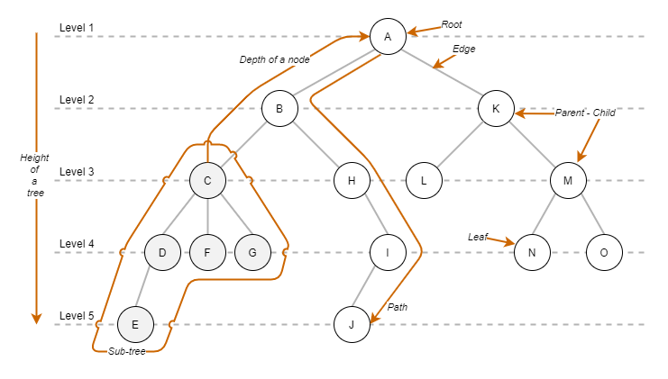
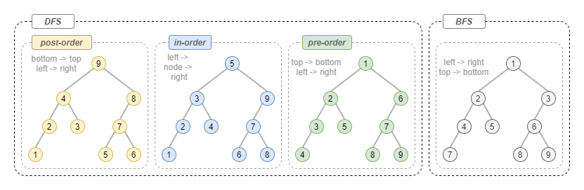

# Trees

A **Tree** is a non-linear _collection_ of elements called nodes connected by edges, arranged in a hierarchical structure with a _parent-child_ relationship between items. There cannot be cycles or unconnected nodes, and at the top of every tree, there is a so-called _root node_, the ancestor of all the other nodes.

There are many special types of tree, that defines additional rules and can efficiently solve particular problems, like:

- ***Binary tree***: where a _parent node_ can have only two children.
- ***Binary search tree*** or (BST): where each node store a value greater than all the nodes of the left subtree, and less than those in the right subtree.
- ***Binary Space Partitioning tree*** or (BSP): that recursively divide an area into two convex sets, allowing faster execution of 3D algorithms that need to process a large set of spatial information.
- Heaps: that is an almost-complete tree where the key of a parent is always greater or equal to one of its children.
- ***Trie*** or prefix tree: where information is stored in edges.
- ***Fenwick tree***: an indexed tree that can efficiently calculate the prefix sum in a table of number.
- ***Red-black tree***: a self-balancing binary search tree.

## Terminology



There is some specific terminology associated with the tree:

- `Node`: any structure that holds data.
- `Root`: the root node is the one from which all other nodes come.
- `Level` of a node: number of edges to the root plus one.
- `Parent`: node with other connecting nodes.
- `Child`: node connected to its parent.
- `Leaf`: a node that has no children.
- `Edge`: a connection between two nodes.
- `Path`: a group of connections.
- `Height of a tree`: number of levels in a _Tree_.
- `Depth of a node`: number of edges from the root of the _Tree_ to that node.

## Operations

### Insert

Inserting an element into a _Tree_ when he has no order is a simple operation, all we need to do is find the first node that doesn't have all the children and add to it the new node.

In the worst case, we need to travel through the number of nodes equal to the height of the tree.

### Search

Since there is no particular order in the nodes of a _Tree_, we could start off by using any of the traversal algorithms to go through the tree, and check if the node has the value that we are searching.

### Delete

A delete operation usually start with a search operation, and we can have different conditions to handle:

- the node found is a _leaf_: we can simply delete it.
- the node has only one child: we can delete it, and connect its child to the old node's parent.
- the node has two children: we can search a leaf, delete the node and attach its child to it.

### Traversal

Since a _Tree_ is a non-linear data structure, can be traversed in multiple ways.



There are two common approaches used to explore it:

- **Depth First Search (DFS)**: where the priority is to explore child nodes first. There is three main way to do this.
  - **pre-order**: visit a node, traverse its left subtree and then its right subtree.
  - **in-order**: traverse its left subtree, visit the node, traverse its right subtree.
  - **post-order**: traverse its left subtree, traverse its a right subtree and then visit the node.
- **Breadth-First Search (BFS)**: where the priority is to visit each node that has the same level, before visiting child nodes.

## Implementation

### Basic Binary Tree

Python3 implementation: [binary_tree.py](../solutions/binary_tree.py)

```python
class Node:

    def __init__(self, value=None):
        self.value = value
        self.left_child = None
        self.right_child = None

class Tree:

    def __init__(self,value=None):
        self.root = Node(value)

    def get_root(self):
        return self.root
```

### Depth First Search

#### Pre Order

This is the iterative version.

```python
def pre_order_iterative(tree):
    visit_order = list()
    stack = Stack()
    node = tree.get_root()

    if node == None:
        return []

    stack.push(node)

    while(not stack.is_empty()):

        node = stack.pop()
        visit_order.append(node.value)

        if node.right_child:
            stack.push(node.right_child)
        if node.left_child:
            stack.push(node.left_child)
```

This is the recursive version.

```python
def pre_order(tree):
    visit_order = list()

    def traverse(node):
        if node:
            visit_order.append(node.value)
            traverse(node.left_child)
            traverse(node.right_child)

    traverse(tree.get_root())

    return visit_order
```

#### In Order

This is the iterative version.

```python
def in_order_iterative(tree):
    visit_order = list()
    stack = Stack()
    node = tree.get_root()

    if node == None:
        return []

    while(not stack.is_empty() or node):

        if node:
            stack.push(node)
            node = node.left_child
        else:
            node = stack.pop()
            visit_order.append(node.value)
            node = node.right_child

    return visit_order
```

This is the recursive version.

```python
def in_order(tree):
    visit_order = list()

    def traverse(node):
        if node:
            traverse(node.left_child)
            visit_order.append(node.value)
            traverse(node.right_child)

    traverse(tree.get_root())

    return visit_order
```

#### Post Order

This is the iterative version.

```python
def post_order_iterative(tree):
    visit_order = list()
    last_node_visited = None
    stack = Stack()
    node = tree.get_root()

    if node == None:
        return []

    while(not stack.is_empty() or node):

        if node:
            stack.push(node)
            node = node.left_child
        else:
            peek_node = stack.peek()
            if peek_node.right_child and last_node_visited != peek_node.right_child:
                node = peek_node.right_child
            else:
                visit_order.append(peek_node.value)
                last_node_visited = stack.pop()

    return visit_order
```

This is the recursive version.

```python
def post_order(tree):
    visit_order = list()

    def traverse(node):
        if node:
            traverse(node.left_child)
            traverse(node.right_child)
            visit_order.append(node.value)

    traverse(tree.get_root())

    return visit_order
```

### Breadth First Search

```python
def bfs(tree):
    visit_order = list()
    q = Queue()
    # start at the root node and add it to the queue
    node = tree.get_root()
    q.enq(node)
    while len(q) > 0:
        node = q.deq()
        visit_order.append(node.value)
        if node.left_child:
            q.enq(node.left_child)
        if node.right_child:
            q.enq(node.right_child)
    return visit_order
```
