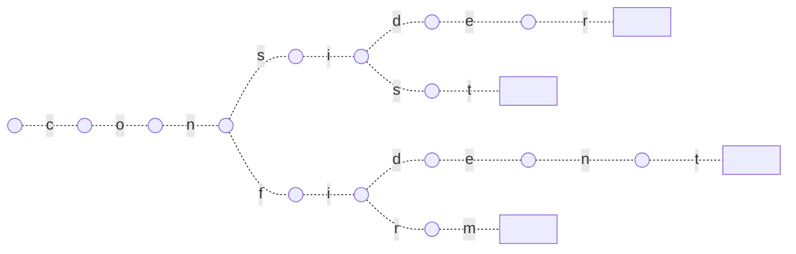

# Tries

A **Trie**, also known as a **Prefix Tree**, is an ordered tree where the keys are usually strings. Unlike a _Binary Search Tree (BST)_: no node store the key, but instead the position of the node in the tree defines the key with which it is associated, and multiple child are possible, potentially one for each letter of the alphabet.

Tries were first described by René de la Briandais in 1959, and are an efficient solution to problem like build a function that provides spell checking, or auto complete.

A alternative way to solve that type of problems can involve _hashmaps_ for storing all the words, and in that case, we will have a _time complexity_ of $O(1)$ for searching a word, and a _space complexity_ of $O(m*n)$, where `m` is the length of the word, and `n` is the number of words.

The basic idea behind the _Trie_ data structure is that many different words share a _common prefix_, so why not save it once? We can then definitely improve space complexity saving prefix only one time, while sacrificing a little on performance.

As an example, just think about four different words to store inside the _Trie_: `consider`, `consist`, `confident`, `confirm`. The _Trie_ structure in that case can be represented as this:



Each node preserve its children into a data structure that allows after to search if the next character is present or not. There are two common implementation, one use an _Array_ with a fixed size of 26, where each element represent a character of the alphabet and point eventually to a child, or a _Hash Map_ with a (char, next_node) pairs.

## Complexity

The _time complexity_ of this data structure, if `K` is the length of the string to insert or search, would be $O(K)$. For _space complexity_, if $N$ is the total number of nodes and $M$ is the size of the alphabet will be $O(N * M)$.

## Practice question

- ***Longest prefix matching***: Given a dictionary of words and an input string, find the longest prefix of the string which is also a word in dictionary.
- ***Pattern matching***: Given a text txt[0..n-1] and a pattern pat[0..m-1], write a function search(char pat[], char txt[]) that prints all occurrences of pat[] in txt[]. You may assume that n > m.
- ***Longest prefix matching***: Given a dictionary of words and an input string, find the longest prefix of the string which is also a word in dictionary.

## Implementations

### Basic Trie using dictionary

We can create a simple node that has a _boolean_ that help to understand if all the characters foudn so far forms a valid word, and a _dictionary of nodes_. A cleaner way to do that is using a `DefaultDict`, that in case the key is not available will return a default value.

```python
from collections import defaultdict

class TrieNode:

  def __init__(self):

    self.is_word = False
    self.children = defaultdict(TrieNode)

class Trie:

  def __init__(self):

    self.root = TrieNode()

  def insert(self, word):

    curr_node = self.root

    for char in word:
      curr_node = curr_node.children[char]

    curr_node.is_word = True

  def search(self, word):

    curr_node = self.root

    for char in word:
      if char not in curr_node.children:
        return False
      curr_node = curr_node.children[char]

    return curr_node.is_word
```

### Basic Trie using an array of characters

Another common implementation of a _Trie_ use an array of 26 elements, one for each letter, instead of the `dict()`.

```python
class TrieNode:

    def __init__(self):

        self.children = [None] * 26
        self.is_word = False

class Trie:

    def __init__(self):

        self.root = TrieNode()

    def _char_to_index(self, ch):
        """
        Converts current character into index from 'a' lower case
        """
        return ord(ch) - ord('a')

    def insert(self, key):

        curr_node = self.root

        for level in range(len(key)):
            index = self._char_to_index(key[level])
            if not curr_node.children[index]:
                curr_node.children[index] = TrieNode()
            curr_node = curr_node.children[index]

        curr_node.is_word = True

    def search(self, key):

        curr_node = self.root

        for level in range(len(key)):
            index = self._char_to_index(key[level])
            if not curr_node.children[index]:
                return False
            curr_node = curr_node.children[index]

        return curr_node != None and curr_node.is_word
```

## References

- [File searching using variable length keys, Rene De La Briandais, 1959](https://www.semanticscholar.org/paper/File-searching-using-variable-length-keys-Briandais/3ce3f4cc1c91d03850ed84ef96a08498e018d18f)
- [Algorithms on Strings, Trees and Sequences: Computer Science and Computational Biology, Dan Gusfield, 1997](https://www.amazon.in/Algorithms-Strings-Trees-Sequences-Computational/dp/0521585198)
- [Algorithms, Sedgewick and Wayne, Addison Wesley, 2011, Chap. 5](https://www.amazon.com/Algorithms-4th-Robert-Sedgewick/dp/032157351X)
