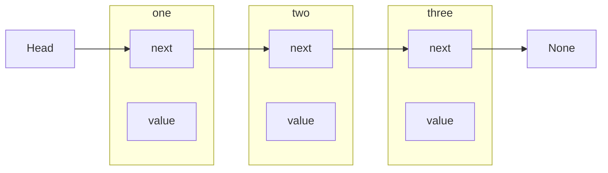

```mermaid
graph LR
  Head-->id2
  id2-->id4
  id4-->id6
  id6-->None
  subgraph one
    id1[value]
    id2[next]
    end
  subgraph two
    id3[value]
    id4[next]
    end
  subgraph three
    id5[value]
    id6[next]
    end
```
