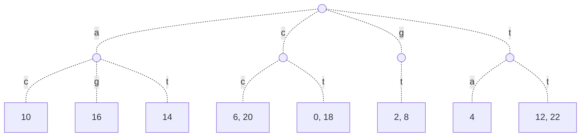

```mermaid
graph TB

  id1((" "));
  id12((" "));
  id13((" "));
  id14((" "));
  id15((" "));

  id121["10"]; id122["16"]; id123["14"];
  id131["6, 20"]; id132["0, 18"];
  id141["2, 8"];
  id151["4"]; id152["12, 22"]

  id1-. a .-id12;
  id1-. c .-id13;
  id1-. g .-id14;
  id1-. t .-id15;

  id12-. c .-id121;
  id12-. g .-id122;  
  id12-. t .-id123;

  id13-. c .-id131;
  id13-. t .-id132;

  id14-. t .-id141;

  id15-. a .-id151;
  id15-. t .-id152;

```
